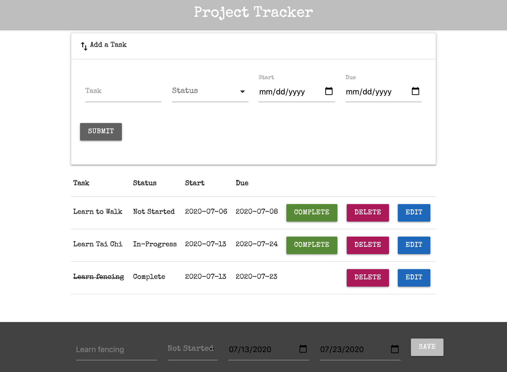

# Project Tracker App

This virtual project management application is perfect for defining tasks for small to medium size projects. Project Tracker solves the problem of Post-it Note clutter that has become so prevalent in the workplace and can be seen on whiteboards, desks, walls and cubicle spaces. Its versatility will astonish you. Take this application to your next business meeting to define key action items. Start your morning with coffee and Project Tracker to help plan you day. Whatever you do, use Project Tracker.

# Description

The development of Project Tarcker was broken down into steps:

1. Key information was defined for the user. [task_name, status, start_date, due_date]
2. The SQL database was created with constraints and validation (character limitations).
3. Routes were defined to represent the CRUD methodology to include: POST, PUT, GET and DELETE.
4. Client code was written to capture data from multiple forms and append to a table on the DOM.
5. Materialize CSS was obtained to create the user interface.
6. The UI was designed to hide the 'create a task' form in a collapsible touch-bar and the edit form off-screen at the bottom of the page.
7. Button functionality was created to indicate when a task was complete and to delete a task.

## Screen Shot

## Usage

Demonstrated User Experience:

1. User clicks the 'Add Task' menu bar to display a form. The form fields include: task name, two levels of task status (In-Progess, Not Started), start date and due date. Only task name is required. All additional information can be updated at any future point in process.
2. Each task has three buttons to initialize functionality. They inlcude the Complete, Delete and Edit buttons.
3. When the user clicks the 'Edit' button, a secondary form appears from the bottom of the screen. This for allows the user to update any or all fields for a task. The status field can be updated to reflect potential delays in task progress or can simply be reverted back to 'Not-Started' at any point. Additionally, the date range can be altered at any time along with the task name.
4. The 'Complete' button marks a task as complete by crossing out the task name and removing the button from the DOM. This can be reverted by clicking the 'Edit' button and setting the status to 'Not Started' or 'In-Progress'.
5. The 'Delete' button simply deletes the task from both the DOM and the database.

## Built With

1. Express
2. Node
3. jQuery
4. SQL
5. CSS / HTML
